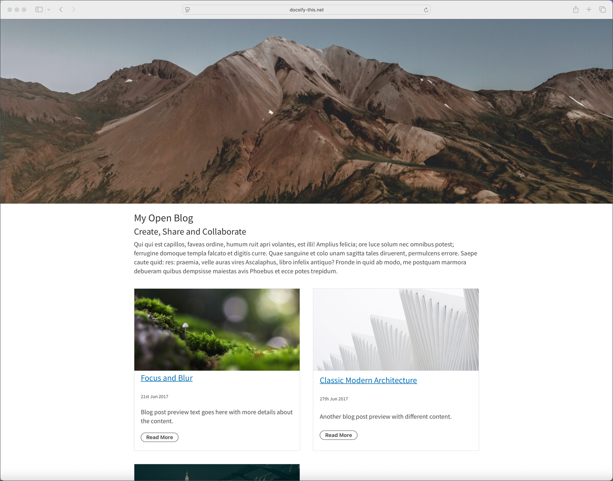

# Docsify-This Multiple Page Blog-Style Site Template

> This is a multiple page blog-style template for use with [Docsify-This.net](https://docsify-this.net/#/).

_Figure 1. Docsify-This Multiple Page Blog-Style Site Template. Explore the resulting standalone web page generated by Docsify-This.net at https://docsify-this.net/?basePath=https://raw.githubusercontent.com/hibbitts-design/docsify-this-multiple-page-blog-style-site/main&homepage=home.md&edit-link=https://github.com/hibbitts-design/docsify-this-multiple-page-blog-style-site/blob/main/home.md_

How to Use
---

1. Sign in to [GitHub](https://github.com), or create an account if you don’t already have one.

2. Tap **Use this template** in this repository (upper-right green button) and then choose **Create a new repository**

3. Choose the name for your new repository to contain the files and then tap **Create repository from template**

4. View an included Markdown file, for example **home.md**, and copy its URL.

5. Go to https://docsify-this.net and paste the copied URL into the **Markdown File URL** field

6. Select the page options you want (e.g. Docsify Sidebar) and tap the **Publish as a Web Page** button to view your Markdown file as a web page for sharing or embedding

To edit a file in GitHub, tap the **Pencil icon** (Edit this file) in the upper-right when viewing the file, make your changes, and then tap the **Commit changes...** button to save those changes.  

Docsify-This Examples
---

[Docsify-This Multiple Page Blog-Style Template](https://github.com/hibbitts-design/docsify-this-multiple-page-blog-style-site), displayed by Docsify-This as a:  
* [Standalone Web Site](https://docsify-this.net/?basePath=https://raw.githubusercontent.com/hibbitts-design/docsify-this-multiple-page-blog-style-site/main&homepage=home.md)
* [Standalone Web Site using the Merriweather font](https://docsify-this.net/?basePath=https://raw.githubusercontent.com/hibbitts-design/docsify-this-multiple-page-blog-style-site/main&homepage=home.md&font-family=Merriweather,Georgia,serif)
* [Standalone Web Site using the Merriweather font with red links](https://docsify-this.net/?basePath=https://raw.githubusercontent.com/hibbitts-design/docsify-this-multiple-page-blog-style-site/main&homepage=home.md&font-family=Merriweather,Georgia,serif&link-color=CC0000)
* [Standalone Web Site and 'Edit this Page' links](https://docsify-this.net/?basePath=https://raw.githubusercontent.com/hibbitts-design/docsify-this-multiple-page-blog-style-site/main&homepage=home.md&edit-link=https://github.com/hibbitts-design/docsify-this-multiple-page-blog-style-site/blob/main/home.md)
