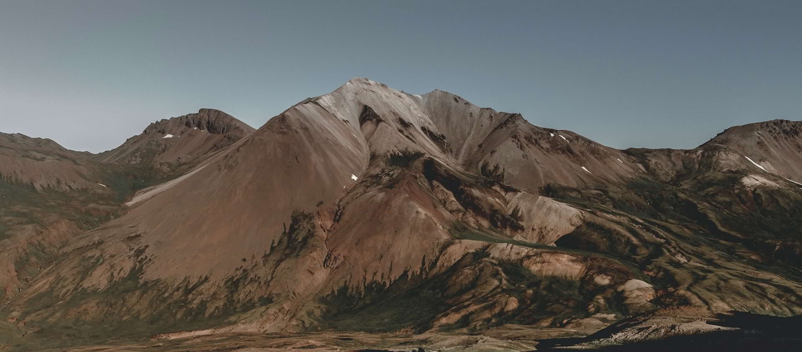

# My Open Blog
## Create, Share and Collaborate

Welcome to my open blog where I share thoughts on design, technology, and creativity. The source Markdown content used in this blog-style site is available for viewing and reuse.

## [Focus and Blur](focus-and-blur.md)

<small>21st Jun 2017</small>

Exploring the art of selective focus in photography and design, and how blur can create compelling visual narratives.  

[Read More](focus-and-blur.md ":class=navpill")

## [Classic Modern Architecture](classic-modern-architecture.md)

<small>27th Jun 2017</small>

A journey through iconic buildings that bridge traditional craftsmanship with contemporary innovation.  

[Read More](classic-modern-architecture.md ":class=navpill")

## [London at Night](london-at-night.md)

<small>7th Jun 2017</small>

Capturing the energy and mystery of London after dark through photography and personal reflection.  

[Read More](london-at-night.md ":class=navpill")

